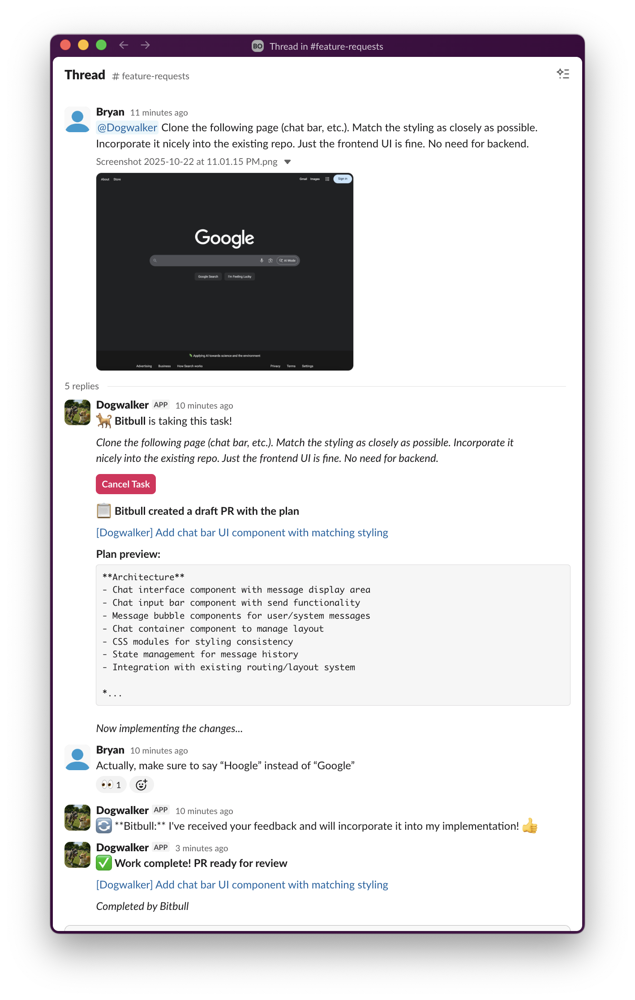

# Dogwalker - Slack Bot that Turns Feature Requests into Pull Requests

Multiple AI agents ("dogs") work in parallel, write tests, and deliver code ready for human review.

Built solo in ~2 days using AI-assisted development.

## See It In Action

After the Dogwalker is @-mentioned, it gets an available AI dog (Coregi) to generate a plan, implement changes, and open a PR.

<p align="center">
  
</p>

**[View the complete Pull Request from this thread →](https://github.com/BryanOwens012/dog-park/pull/45)**


## How It Works

1. Mention `@dogwalker add rate limiting to /api/login` in Slack
2. AI creates a draft PR with implementation plan
3. AI writes code, self-reviews, and adds tests
4. PR marked ready for human review (4-10 minutes total)

**Key features:** Multiple dogs working in parallel, bi-directional communication (reply to give feedback), web browsing (include URLs in tasks), automatic before/after screenshots for UI changes.

## About Self-Hosting

When you self-host Dogwalker, **you create your own Slack bot** in your workspace. This is simpler than it sounds:

1. Go to https://api.slack.com/apps → "Create New App" → "From an app manifest"
2. Paste the contents of `apps/slack-bot/manifest.json` (included in this repo)
3. Install the app to your workspace
4. Copy the bot tokens to your `.env` file

The manifest handles all permissions and settings automatically. You can customize the bot name, avatar, and description to match your team's style. Full instructions are in `.env.example`.

**You control everything:** Your Slack bot, your infrastructure, your data. Built with open-source libraries, so it's fully transparent and customizable.

## Getting Started

### Quick Start
```bash
# Prerequisites: Python 3.10+, Redis, Slack workspace, GitHub account, Anthropic API key

git clone <this-repo>
brew install redis  # or apt-get install redis
cp .env.example .env  # Fill in your credentials
pip install -r requirements.txt
redis-server

# Terminal 1
cd apps/orchestrator && python src/bot.py

# Terminal 2
cd apps/worker && celery -A src.celery_app worker --loglevel=info
```

Then mention `@dogwalker` in Slack and watch it work!

### Setup Details
1. **Create Slack app:** Use `apps/slack-bot/manifest.json` at https://api.slack.com/apps
2. **Configure environment:** Copy `.env.example` to `.env` and fill in:
   - `ANTHROPIC_API_KEY` - Your Claude API key
   - `SLACK_BOT_TOKEN` and `SLACK_APP_TOKEN` - From Slack app settings
   - `GITHUB_REPO` - Your repo (e.g., `yourcompany/yourrepo`)
   - `DOGS` - JSON array of dog accounts (GitHub username, email, token)
   - `REDIS_URL` - Usually `redis://localhost:6379`
3. **Create dog GitHub accounts:** Each dog needs a separate GitHub account with repo access

See [DEPLOYMENT.md](docs/DEPLOYMENT.md) for cloud deployment (Railway, Docker, AWS/GCP/Azure).

## Implemented Features

**Core Workflow**
- Multi-agent architecture with load balancing (configure 1-N dogs)
- Draft PR workflow: plan → implement → self-review → test → ready for review
- Task cancellation with graceful shutdown and partial PR updates

**Communication**
- Slack integration with real-time thread updates
- Bi-directional: dogs respond to feedback and ask questions during execution
- Conversational development workflow

**Visual & Research**
- Before/after screenshots for UI changes (auto-detects frontend tasks)
- Web browsing: include URLs in tasks for reference implementation
- Proactive internet search: dogs autonomously research current docs/APIs

**Infrastructure**
- Socket Mode (no public webhooks, works behind firewalls)
- Celery + Redis task queue
- Single repo per deployment

## Future Enhancements

- Reaction-based responses (emoji quick decisions)
- Dog specialization (frontend/backend/tests)
- Multi-repo support
- Visual regression testing
- Platform integrations (Discord, Teams, GitHub Discussions)

See full roadmap in [Future Enhancements](#future-enhancements).

## Tech Stack

- **Code generation:** Aider + Claude Sonnet 4.5
- **Task queue:** Celery + Redis
- **Communication:** Slack Bolt (Socket Mode)
- **Web automation:** Playwright
- **Search:** DuckDuckGo

## Architecture

```
Slack @mention → Orchestrator (selects least-busy dog) → Worker (dog) clones repo
→ Aider generates plan → Draft PR posted → Aider implements code
→ Self-review → Tests → Final PR ready for review → Slack notification
```

See [ARCHITECTURE.md](docs/ARCHITECTURE.md) for details.

## Environment Variables

```bash
ANTHROPIC_API_KEY=sk-ant-...          # Your Claude API key
SLACK_BOT_TOKEN=xoxb-...              # From Slack app OAuth page
SLACK_APP_TOKEN=xapp-...              # From Slack app settings
GITHUB_REPO=yourcompany/yourrepo      # Target repository
REDIS_URL=redis://localhost:6379      # Redis instance

# Configure 1-N dogs (JSON array)
DOGS='[
  {"name": "YourCompany-Coregi", "email": "coregi@yourcompany.com", "github_token": "github_pat_..."},
  {"name": "YourCompany-Bitbull", "email": "bitbull@yourcompany.com", "github_token": "github_pat_..."}
]'
```

See `.env.example` for full configuration options.

## Limitations

- The quality of the generated code is nondeterministic. Always review before merging. It might take a few tries to get it right.
- The code generation part (Aider) is particularly buggy. Will need improvement.
- Dogs aren't able to handle more than 200k tokens of context. Plan requests accordingly. E.g., commit large files separately.
- When a dog crashes, it loses all its state and must restart with a clean slate.

## Contributing

Contributions welcome! This is community-driven software.

- Report bugs and request features via [GitHub Issues](https://github.com/your-org/dogwalker/issues)
- Submit PRs for bug fixes or new features
- Follow code style in [CLAUDE.md](CLAUDE.md)

## Similar Projects

- **Sweep AI** - GitHub issues → PRs (acquired by Roblox)
- **Devin** - Full AI engineer (closed waitlist)
- **Factory AI** - Enterprise multi-agent coding
- **GitHub Copilot Workspace** - IDE-integrated assistant

**What makes Dogwalker different:** Open source, self-hosted (you control your data), highly customizable, Slack-native with bi-directional communication, multi-agent parallel processing.

## References

- [Aider](https://github.com/paul-gauthier/aider)
- [Celery](https://docs.celeryq.dev/)
- [Slack Bolt](https://slack.dev/bolt-python/)
- [Deployment Guide](docs/DEPLOYMENT.md)
- [Architecture Details](docs/ARCHITECTURE.md)
